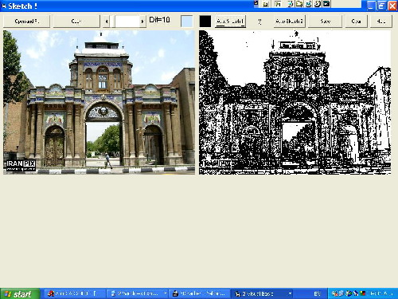



## SketchPhoto

### Description

Converts a photo to a painting!!! When you want to draw a face, what do you do? You'll draw borders, if you use "Auto Sketch 1" does the same! If you use "Auto Sketch 2" you will draw a photo just by using Black and White ( No gray).

Also you can draw manually, read HELP for more comments.
 
### More Info
 

             |
---                |---
**Submitted On**   |2004-07-20 17:50:46
**By**             |[Mahdi Shakouri Rad](https://github.com/Planet-Source-Code/PSCIndex/blob/master/ByAuthor/mahdi-shakouri-rad.md)
**Level**          |Beginner
**User Rating**    |4.2 (25 globes from 6 users)
**Compatibility**  |VB 6\.0
**Category**       |[Graphics](https://github.com/Planet-Source-Code/PSCIndex/blob/master/ByCategory/graphics__1-46.md)
**World**          |[Visual Basic](https://github.com/Planet-Source-Code/PSCIndex/blob/master/ByWorld/visual-basic.md)
**Archive File**   |[SketchPhot1773657242004\.zip](https://github.com/Planet-Source-Code/mahdi-shakouri-rad-sketchphoto__1-55153/archive/master.zip)

